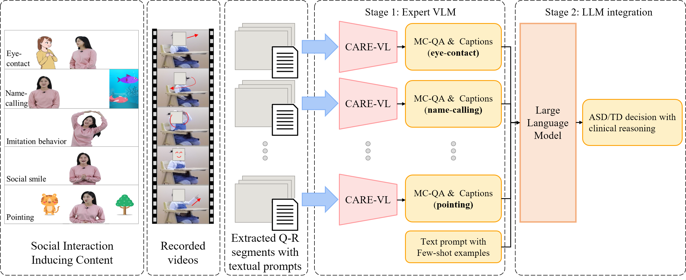
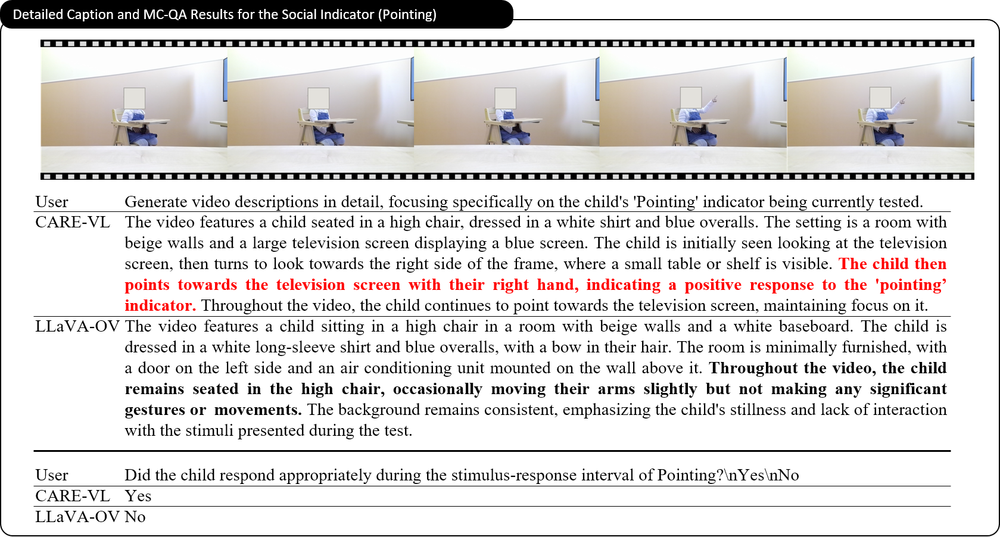

# CARE-VL: A Domain-Specialized Vision-Language Model for Early ASD Screening - Official-Pytorch-Implementation

> CARE-VL: A Domain-Specialized Vision-Language Model for Early ASD Screening
>
> Cheol-Hwan Yoo*, Jang-Hee Yoo, Jae-Yoon Jang
>
> MICCAI 2025 (accepted)
>
> We propose an autism spectrum disorder (ASD) screening framework that integrates an expert vision-language model (VLM), CARE-VL, with a large language model (LLM)-based aggregation module to assess children's social interactions and derive subject-level ASD/typical development (TD) classifications.  
Our framework processes video data collected using social interaction-inducing content, where medical experts annotated predefined query-response (Q-R) intervals based on key social indicators—such as response to name, eye contact, imitation behavior, social smiling, and pointing—by marking correct responses and assigning subject-level ASD/TD classifications. 
To adapt the general-purpose VLM to the ASD screening domain, we constructed a synthetic instruction-tuning dataset using a label-guided reasoning method on these clinical tags, fine-tuning the model to generate detailed captions and multiple-choice question-answer (MC-QA) pairs, capturing children's critical social behaviors.  
CARE-VL processes Q-R intervals to produce clip-level MC-QA results and descriptive captions, which are then aggregated by an LLM to derive final ASD/TD classification and clinical reasoning.  
Our end-to-end framework combines visual understanding and linguistic reasoning, achieving 84.6% accuracy for clip-level response prediction and 75.8% accuracy for subject-level ASD/TD classification. These results demonstrate the potential of our framework as a practical and interpretable tool for early ASD screening and behavioral assessment.
---

## Updates
19/06/2025: Project page built
>

All code related to this work will be made available. 

## Get Started

## Training

## Test

## Model

## Experimental Results

Comparison of CARE-VL and the general VLM in generating detailed captions and MC-QA responses for the social indicator.

| Model | **Overall Acc.** | Response to Name | Eye Contact | Imitation Behavior | Social Smiling | Pointing | Caption |
|-------|------------------|------------------|-------------|--------------------|----------------|----------|---------|
| Chat-UniVi-7B [[jin2024chat]] | 28.8 | **69.7** | 35.6 | 14.6 | 20.1 | 21.5 | 48.8 |
| Video-LLaVA-7B [[lin2023video]] | 29.1 | **69.7** | 35.4 | 14.1 | 13.6 | 21.2 | 30.5 |
| LLaVA-Video-7B [[zhang2024video]] | 31.5 | 62.9 | 37.1 | 16.2 | 17.4 | 29.8 | _**57.7**_ |
| LLaVA-NeXT-Video-7B [[zhang2024llavanextvideo]] | 34.5 | 32.6 | 39.1 | 25.8 | 38.3 | 37.6 | 55.3 |
| LLaVA-OV-0.5B [[li2024llava]] | 49.2 | 60.2 | 39.6 | 58.1 | 34.5 | 52.5 | 35.3 |
| LLaVA-OV-7B [[li2024llava]] | _**61.2**_ | 36.4 | _**60.9**_ | _**68.4**_ | _**57.6**_ | _**73.5**_ | 53.3 |
| **CARE-VL (Ours)** | **84.6** | _**68.9**_ | **72.7** | **94.2** | **92.0** | **92.4** | **69.5** |

---

### References

- [jin2024chat]: https://arxiv.org/abs/2401.xxxx
- [lin2023video]: https://arxiv.org/abs/2309.xxxx
- [zhang2024video]: https://arxiv.org/abs/2402.xxxx
- [zhang2024llavanextvideo]: https://arxiv.org/abs/2403.xxxx
- [li2024llava]: https://arxiv.org/abs/2312.xxxx

## LICENSE
Please see [LICENSE.md](../LICENSE.md).

## Contact
If you have any question or comment, please email <ch.yoo@etri.re.kr>.
