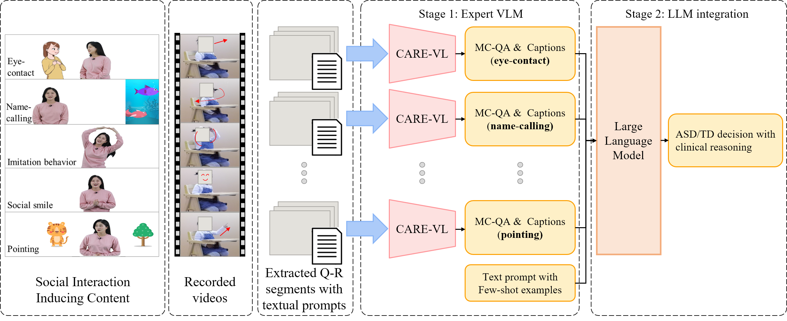
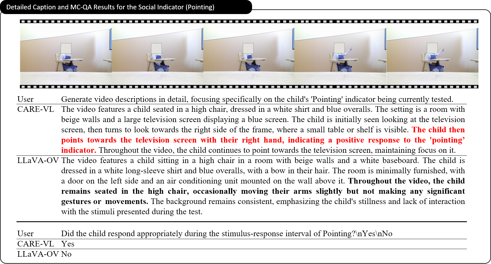

# CARE-VL: A Domain-Specialized Vision-Language Model for Early ASD Screening - Official-Pytorch-Implementation




> CARE-VL: A Domain-Specialized Vision-Language Model for Early ASD Screening
>
> Cheol-Hwan Yoo*, Jang-Hee Yoo, Jae-Yoon Jang
>
> MICCAI 2025 (accepted)
>
> We propose an autism spectrum disorder (ASD) screening framework that integrates an expert vision-language model (VLM), CARE-VL, with a large language model (LLM)-based aggregation module to assess children's social interactions and derive subject-level ASD/typical development (TD) classifications.  
Our framework processes video data collected using social interaction-inducing content, where medical experts annotated predefined query-response (Q-R) intervals based on key social indicators—such as response to name, eye contact, imitation behavior, social smiling, and pointing—by marking correct responses and assigning subject-level ASD/TD classifications. 
To adapt the general-purpose VLM to the ASD screening domain, we constructed a synthetic instruction-tuning dataset using a label-guided reasoning method on these clinical tags, fine-tuning the model to generate detailed captions and multiple-choice question-answer (MC-QA) pairs, capturing children's critical social behaviors.  
CARE-VL processes Q-R intervals to produce clip-level MC-QA results and descriptive captions, which are then aggregated by an LLM to derive final ASD/TD classification and clinical reasoning.  
Our end-to-end framework combines visual understanding and linguistic reasoning, achieving 84.6% accuracy for clip-level response prediction and 75.8% accuracy for subject-level ASD/TD classification. These results demonstrate the potential of our framework as a practical and interpretable tool for early ASD screening and behavioral assessment.
---

## Updates
19/06/2025: Project page built
>
25/06/2025: Code released

All code related to this work is now available. 

## Get Started
- Clone this repo and install dependencies:
```bash
# Install Python>=3.10 environment with PyTorch>=2.0
git clone https://github.com/etri/AI4ASD.git
cd AI4ASD/CARE-VL

# Install LLaVA-NeXT (base framework)
pip install git+https://github.com/LLaVA-VL/LLaVA-NeXT.git

# Install additional dependencies
pip install -r requirements.txt
```

## Data Preparation

### 1. Prepare SIIC Video Data
Organize your video data following this structure:
```
/path/to/SIIC_data/
├── <participant_id>/
│   ├── 03/                     # name-calling indicator
│   │   ├── rec/               # video recordings
│   │   │   ├── 000_*.mp4
│   │   │   ├── 001_*.mp4
│   │   │   └── 002_*.mp4
│   │   └── 01/                # tagging info
│   │       ├── 000/event_info.txt
│   │       ├── 001/event_info.txt
│   │       └── 002/event_info.txt
│   ├── 04/                     # eye-contact
│   ├── 06/                     # imitation-behavior
│   ├── 07/                     # social-smiling
│   └── 08/                     # pointing
└── ...
```

### 2. Generate Instruction-Tuning Dataset
```bash
python data/generate_visual_instruction_tuning_DB.py \
    --data_dir /path/to/SIIC_data/ \
    --output_dir dataset/ \
    --output_prefix SIIC_visual_instruct
```
This generates:
- `SIIC_visual_instruct_caption.json` — Detailed captions with label-guided reasoning
- `SIIC_visual_instruct_mcqa.json` — MC-QA pairs for response classification

## Training

### Stage 1: VLM Fine-tuning
Fine-tune LLaVA-OneVision on the SIIC instruction-tuning dataset:
```bash
# Edit train_vlm.sh to set your paths
# - VIDEO_FOLDER: path to video data
# - DATA_PATH: path to dataset config (configs/onevision_SIIC.yaml)
# - Update dataset JSON paths in configs/onevision_SIIC.yaml

bash train_vlm.sh
```

Key training hyperparameters:
| Parameter | Value |
|-----------|-------|
| Base model | `lmms-lab/llava-onevision-qwen2-7b-ov` |
| Learning rate | 1e-5 |
| Batch size | 1 (per GPU) |
| Gradient accumulation | 2 |
| Epochs | 1 |
| Frames per video | 16 |
| DeepSpeed | ZeRO Stage 3 |

## Test

### Stage 1: VLM Inference (Clip-level)
```bash
python inference_vlm.py \
    --model_path checkpoints/care-vl-siglip-Qwen2-7B-SIIC \
    --data_dir /path/to/test_data/ \
    --output_dir results/ \
    --question_type MCQA DC
```

### Stage 2: LLM Classification (Subject-level)
Uses few-shot exemplars from the source site (SNUBH) with DSM-5 criteria:
```bash
python inference_llm.py \
    --test_caption_json results/caption_inference_results.json \
    --test_mcqa_json results/mcqa_inference_results.json \
    --test_tagging_xlsx /path/to/PNU_ASD_TD_tagging.xlsx \
    --test_site PNU \
    --fewshot_caption_json dataset/SIIC_visual_instruct_caption_5_indicator_SNUBH.json \
    --fewshot_mcqa_json dataset/SIIC_visual_instruct_mcqa_5_indicator_SNUBH.json \
    --fewshot_tagging_xlsx /path/to/SNUBH_ASD_TD_tagging.xlsx \
    --fewshot_site SNUBH \
    --asd_examples AI-153-03 AI-200-03 \
    --td_examples AI-232-03 AI-240-04 \
    --llm_model meta-llama/Llama-3.2-3B-Instruct
```

### Evaluation with LLaVA-Critic
```bash
# Pointwise evaluation (caption quality scoring)
python pointwise_critic.py \
    --json_path results/caption_inference_results.json \
    --output_path results/pointwise_scores.json \
    --data_dir /path/to/test_data/
```


## Experimental Results

Comparison of CARE-VL and the general VLM in generating detailed captions and MC-QA responses for the social indicator.



Performance comparison between baseline models and CARE-VL. MC-QA measures correct response identification across social indicators, while caption evaluates descriptive quality.
| Model | **Overall Acc.** | Response to Name | Eye Contact | Imitation Behavior | Social Smiling | Pointing | Caption |
|-------|------------------|------------------|-------------|--------------------|----------------|----------|---------|
| Chat-UniVi-7B  | 28.8 | **69.7** | 35.6 | 14.6 | 20.1 | 21.5 | 48.8 |
| Video-LLaVA-7B  | 29.1 | **69.7** | 35.4 | 14.1 | 13.6 | 21.2 | 30.5 |
| LLaVA-Video-7B  | 31.5 | 62.9 | 37.1 | 16.2 | 17.4 | 29.8 | 57.7 |
| LLaVA-NeXT-Video-7B  | 34.5 | 32.6 | 39.1 | 25.8 | 38.3 | 37.6 | 55.3 |
| LLaVA-OV-0.5B  | 49.2 | 60.2 | 39.6 | 58.1 | 34.5 | 52.5 | 35.3 |
| LLaVA-OV-7B  | 61.2 | 36.4 | 60.9 | 68.4 | 57.6 | 73.5 | 53.3 |
| **CARE-VL (Ours)** | **84.6** | 68.9 | **72.7** | **94.2** | **92.0** | **92.4** | **69.5** |

---


## LICENSE
Please see [LICENSE.md](../LICENSE.md).

## Citation
If you make use of our work, please cite our paper.
```bibtex
@inproceedings{yoo2025care,
  title={CARE-VL: A Domain-Specialized Vision-Language Model for Early ASD Screening},
  author={Yoo, Cheol-Hwan and Yoo, Jang-Hee and Jang, Jaeyoon},
  booktitle={International Conference on Medical Image Computing and Computer-Assisted Intervention},
  pages={57--66},
  year={2025},
  organization={Springer}
}
```

## Contact
If you have any question or comment, please email <ch.yoo@etri.re.kr>.
