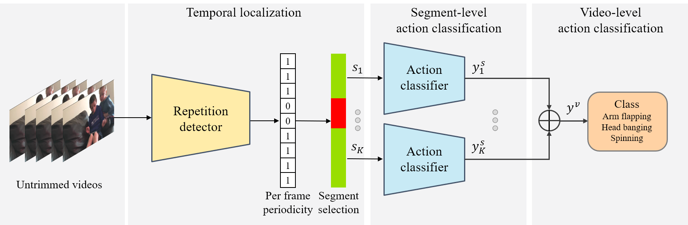

# A Unified Approach to Stereotyped Behavior Detection for Screening Autism Spectrum Disorder - Official-Pytorch-Implementation




This repository provides the official PyTorch implementation of the following **[paper](https://www.sciencedirect.com/science/article/pii/S0167865524002897)**


> A Unified Approach to Stereotyped Behavior Detection for Screening Autism Spectrum Disorder
>
> Cheol-Hwan Yoo, Jang-Hee Yoo, Moon-Ki Back, Woo-Jin Wang, Yong-Goo Shin*
>
> Pattern Recognition Letters 2024 
>
>
> Abstract: We propose a unified pipeline for the task of stereotyped behaviors detection for early diagnosis of Autism Spectrum Disorder (ASD). Current methods for analyzing autism-related behaviors of ASD children primarily focus on action classification tasks utilizing pre-trimmed video segments, limiting their real-world applicability. To overcome these challenges, we develop a two-stage network for detecting stereotyped behaviors: one for temporally localizing repetitive actions and another for classifying behavioral types. Specifically, building on the observation that stereotyped behaviors commonly manifest in various repetitive forms, our method proposes an approach to localize video segments where arbitrary repetitive behaviors are observed. Subsequently, we classify the detailed types of behaviors within these localized segments, identifying actions such as arm flapping, head banging, and spinning. Extensive experimental results on SSBD and ESBD datasets demonstrate that our proposed pipeline surpasses existing baseline methods, achieving a classification accuracy of 88.3% and 88.6%, respectively.

---

## Updates
22/04/2024: Project page built
>
15/11/2024: Project v1.2 update

All code and datasets related to this work will be made available. 

## Get Started
- Clone this repo and install dependencies:
```bash
install  Python>=3.8 environment with PyTorch>=1.8
git clone this repository
cd pbr4RRB
pip install -r requirements.txt
```

## Training
- Firstly, download video file (SSBD, ESBD, Countix, ...).
- To download and parse datasets, run the command below:
```python
python data/download_video_from_URL_SSBD_ESBD.py
python data/parse_SSBD_dataset.py
python data/parse_ESBD_dataset.py
python data/download_video_from_URL_countix.py
python data/parse_countix_dataset.py
```

- To train code, run the command below:
```python
python main_classifier.py
python main_repdetector.py
```

## Test

- To test code, run the command below:
```python
python demo.py --data_choice 'ESBD' or 'SSBD'
```


## Model

We provide our pre-trained models. 
You can test our network by putting pre-trained models on checkpoints folder.
- RRB_LA_Net_tr_countix.checkpoint : Repetition detector trained on Counitx.
https://drive.google.com/file/d/17KD7lQ5xm9lV9zsAqtL0sz9UO4aynJ7m/view?usp=drive_link
- RRB_RA_Net_tr_ESBD_parsing.checkpoint : Action classifier (VST) trained on parsed ESBD.
https://drive.google.com/file/d/1scUBv1v3HSenmo4ix4LKNfVMyOJQpVP8/view?usp=drive_link
- RRB_RA_Net_tr_SSBD_parsing.checkpoint : Action classifier (VST) trained on parsed SSBD.
https://drive.google.com/file/d/19Vamf353wwHyerQPjOkQbJhRqX7YObhs/view?usp=drive_link


## Experimental Results

Examples of result images on the *SSBD* and *ESBD* dataset. 
The green and red colors denote whether a frame belongs to a repetitive segment or not, respectively.


## LICENSE
Please see [LICENSE.md](../LICENSE.md).

## Citation
If you make use of our work, please cite our paper.
```bibtex
@article{yoo2024unified,
  title={A unified framework to stereotyped behavior detection for screening Autism Spectrum Disorder},
  author={Yoo, Cheol-Hwan and Yoo, Jang-Hee and Back, Moon-Ki and Wang, Woo-Jin and Shin, Yong-Goo},
  journal={Pattern Recognition Letters},
  volume={186},
  pages={156--163},
  year={2024},
  publisher={Elsevier}
}
```
## Contact
If you have any question or comment, please email <ch.yoo@etri.re.kr>.
