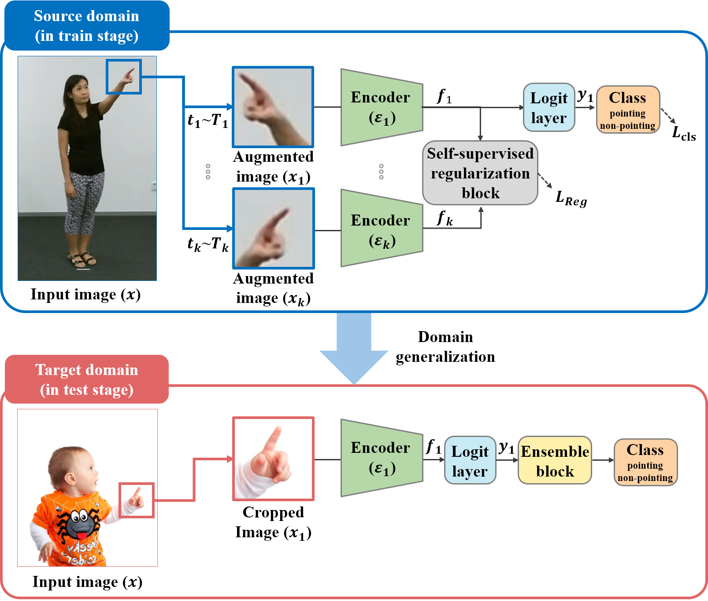
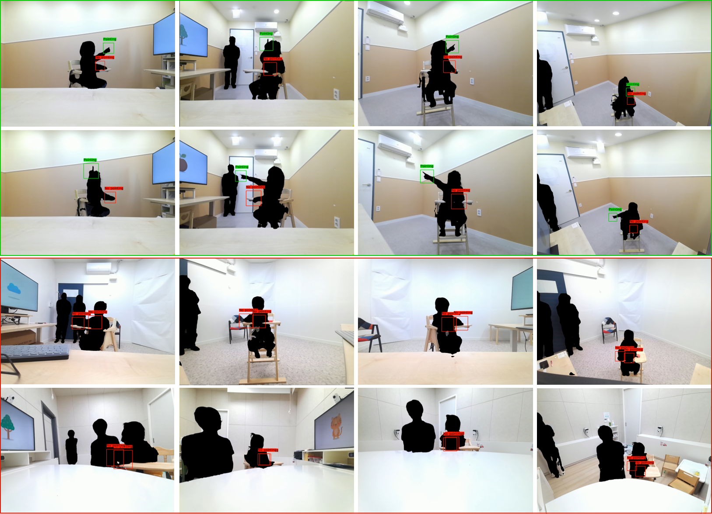

# Pointing Gesture Recognition via Self-supervised Regularization for ASD

This repository is the official implementation of **[Pointing Gesture Recognition via Self-supervised Regularization for ASD](https://openaccess.thecvf.com/content/ICCV2023W/ASI/html/Yoo_Pointing_Gesture_Recognition_via_Self-Supervised_Regularization_for_ASD_Screening_ICCVW_2023_paper.html)**




> Pointing Gesture Recognition via Self-supervised Regularization for ASD
Screening 
>
> Cheol-Hwan Yoo, Jang-Hee Yoo, Ho-Won Kim, ByungOk Han*
>
> ICCVW 2023 
>
>
> Abstract: The ability to point to objects for sharing social purpose or attention is known as one of the key indicators in distinguishing children with typical development (TD) from those with autism spectrum disorder (ASD). However, there is a lack of datasets specifically tailored for children’s pointing gestures. This lack of training data from the target domain becomes a major factor in the performance degradation of conventional supervised CNNs due to domain shift. Toward an effective and practical solution, we propose an end-to-end learning scheme for domain generalized pointing gesture recognition adopting self-supervised regularization (SSR). To prove the effectiveness of our method in real-world situations, we designed a Social Interaction-Inducing Content (SIIC)-based ASD diagnostic system and collected an ASD-Pointing dataset consisting of 40 TD and ASD children. Through extensive experiments on our collected datasets, we achieved an ASD screening accuracy of 72.5%, showing that pointing ability can play a vital role as an indicator in distinguishing between ASD and TD.

---

## Updates
07/10/2023: Project page built

08/05/2024: Code update - removing depth dependency

All code related to this work will be made available. 

## Get Started
- Clone this repo and install dependencies:
```bash
install  Python>=3.8 environment with PyTorch>=1.8
git clone this repository
cd pbr4pointing
pip install -r requirements.txt
```
## Training
- Prepare image file in .jpg or .png format.
After preparing data, the data folder should be like the format below (0:pointing, 1:not pointing):

```
data
├─ ntu_rgbd
│ ├─ pointing_binary    
│ │ ├─ 0_samples_train
│ │ | ├─ xxxx.png
| │ │ ├─ ......
│ │ ├─ 0_samples_val
│ │ | ├─ xxxx.png
| │ │ ├─ ......
│ │ ├─ 1_samples_train
│ │ | ├─ xxxx.png
| │ │ ├─ ......
│ │ ├─ 1_samples_val
│ │ | ├─ xxxx.png
| │ │ ├─ ......

```

- To train code, run the command below:
```python
python main.py --model_name 'model_name' --SSL ['None', 'SimSiam', 'BYOL'] --backbone ['resnet, 'vit_B_32']
```

## Test
<!--To identify children among the people present in the scene we utilize OpenPose. 

To run the test(demo) code, you need to include the additional *lib* and *evaluate* folder in our project folder after following the installation guide at the following URL.
(https://github.com/tensorboy/pytorch_Realtime_Multi-Person_Pose_Estimation). 

Also, please download pose_model.pth from the corresponding github and put it in the checkpoints folder.-->

To identify children among the people present in the scene and detect hand region, we utlize YOLO-World and MediaPipe.

To run the test(demo) code, you need to download child_adult_yolow.onnx from the link(https://drive.google.com/file/d/1gLLPwWOaH6bwVN091Gat_d8vRaH63fBw/view?usp=drive_link) and put it in the checkpoints folder.

- Prepare recorded video file in .mp4 or .avi format.
After preparing data, the data folder should be like the format below:

```
living_lab_db
├─ pointing_negative    
│ ├─ subject_nmae
│ | ├─ xxxx.mp4
│ ├─ ......
│
├─ pointing_positive    
│ ├─ subject_nmae
│ | ├─ xxxx.mp4
│ ├─ ......
│

```

- To test code, run the command below:
```python
python demo_livinglab.py --model_name 'model_name' --SSL ['None', 'SimSiam', 'BYOL'] --backbone ['resnet, 'vit_B_32']
```

## Model

We provide our pre-trained models. 
You can test our network by putting pre-trained models on checkpoints/logs/resnet50_ntu or resnet50_ntu_SimSiam/model_best.checkpoint

- ResNet-50 (baseline):
https://drive.google.com/file/d/11Ay-PPXre0SXkWp6X4epiUwXXRo031XE/view?usp=drive_link
- Proposed<sub>SimSiam</sub>:
https://drive.google.com/file/d/19wmz5ve8Go62dWoKaSP_7DbCdds6l1VH/view?usp=drive_link

## Experimental Results

Examples of result images on the *ASD-Pointing* dataset. The green and red colors represent test cases where pointing is performed
and not performed, respectively. The videos were captured with four Azure Kinect cameras in three living lab spaces.



|   Model                | Accuracy | Recall     | Precision   | F1-score    |
| :---------:            | :-------:| :--------: | :---------: | :---------: |
| ResNet-50 (baseline)   | 84.8     | 66.2       | 53.5        | 59.2        |
| Proposed (BYOL)        | 86.3     | 63.7       | 58.0        | 60.7        |
| Proposed (SimSiam)     | 86.5     | 76.2       | 57.0        | 65.2        |
| ViT-B/32 (baseline)    | 61.9     | 98.7       | 30.3        | 46.3        |
| Proposed (BYOL)        | 75.0     | 97.5       | 39.8        | 56.5        |
| Proposed (SimSiam)     | 75.2     | 98.7       | 40.1        | 57.0        |

## LICENSE
Please see [LICENSE.md](../LICENSE.md).

## Citation
If you make use of our work, please cite our paper.
```bibtex
@inproceedings{yoo2023pointing,
  title={Pointing Gesture Recognition via Self-Supervised Regularization for ASD Screening},
  author={Yoo, Cheol-Hwan and Yoo, Jang-Hee and Kim, Ho-Won and Han, ByungOk},
  booktitle={Proceedings of the IEEE/CVF International Conference on Computer Vision},
  pages={3036--3043},
  year={2023}
}
```
## Contact
If you have any question or comment, please email <ch.yoo@etri.re.kr>.
